# *Pac-Man* en JavaFX

## Description

Ce projet fournit une implémentation de base du jeu *Pac-Man* en *JavaFX*.
Pour pouvoir développer votre propre implémentation de ce projet, vous devez
en créer une **divergence** en cliquant sur le bouton `Fork` en haut à droite
de cette page.

Lorsque ce sera fait, vous pourrez inviter les membres de votre groupe en tant
que *Developer* pour vous permettre de travailler ensemble sur ce projet.

## Consignes

Vous pouvez retrouver ci-dessous les liens vers les sujets de TP vous guidant
dans le développement de votre projet :

- [Lancement du projet](https://gitlab.univ-artois.fr/enseignements-rwa/modules/but-2/r3-04/tp/-/tree/main/tp/TP03)
- [Des patrons de conception dans *Pac-Man* (1)](https://gitlab.univ-artois.fr/enseignements-rwa/modules/but-2/r3-04/tp/-/tree/main/tp/TP04)
- [Des patrons de conception dans *Pac-Man* (2)](https://gitlab.univ-artois.fr/enseignements-rwa/modules/but-2/r3-04/tp/-/tree/main/tp/TP05)
- [Des patrons de conception dans *Pac-Man* (3)](https://gitlab.univ-artois.fr/enseignements-rwa/modules/but-2/r3-04/tp/-/tree/main/tp/TP06)
- [Bonnes pratiques de la POO dans le projet *Pac-Man*](https://gitlab.univ-artois.fr/enseignements-rwa/modules/but-2/r3-04/tp/-/tree/main/tp/TP07)

## Chef de projet

Léo Monsterleet

## Diagramme de classes

```plantuml
hide empty members

@startuml

hide empty members
skinparam classAttributeIconSize 0
skinparam linetype ortho

' -------------------------- '
' Entry Points & Main        '
' -------------------------- '

class Launcher {
    + {static} main(args : String[])
}

class PacmanApplication extends Application {
    - {static} GAME_WIDTH : int
    - {static} GAME_HEIGHT : int
    - {static} NB_GHOSTS : int
    + start(stage : Stage)
    + {static} main(args : String[])
}

class Application {
    'Classe JavaFX standard
}

' -------------------------- '
' Core & Game Loop           '
' -------------------------- '

interface IGame {
    + getSpriteStore() : ISpriteStore
    + getWidth() : int
    + getHeight() : int
    + getCellAt(x : int, y : int) : Cell
    + getGameMap() : GameMap
    + getPlayer() : Pacman
    + getAnimatedObjects() : List<IAnimated>
    + addAnimated(animated : IAnimated)
    + removeAnimated(animated : IAnimated)
    + pacGumEaten(gum : IAnimated)
    + megaPacGumEaten(gum : IAnimated)
    + bonusEaten(bonus : Object)
    + playerIsDead()
    + resetRound()
}

class PacmanGame implements IGame {
    - levelProperty : IntegerProperty
    - width : int
    - height : int
    - nbGhosts : int
    - nbGums : int
    - movingObjects : List<IAnimated>
    - animatedObjects : List<IAnimated>
    + PacmanGame(...)
    + start()
    + prepare()
    + moveUp()
    + moveDown()
    + moveLeft()
    + moveRight()
    - createMap() : GameMap
    - createAnimated()
    - spawnAnimated(animated : IAnimated)
    - gameOver(message : String)
}

class GameAnimation {
    - movingObjects : List<IAnimated>
    - animatedObjects : List<IAnimated>
    - previousTimestamp : long
    + start()
    + handle(now : long)
    - updateObjects(delta : long)
    - checkCollisions()
}

interface IPacmanController {
    + setGame(game : PacmanGame)
    + prepare(map : GameMap)
    + addAnimated(movable : IAnimated)
    + gameOver(message : String)
    + bindLife(lives : IntegerProperty)
    + bindScore(score : IntegerProperty)
    + reset()
}

class PacmanController implements IPacmanController {
    - stage : Stage
    - game : IGame
    + setStage(stage : Stage)
    ' ... méthodes FXML ...
}

' -------------------------- '
' View & Sprites (Singleton) '
' -------------------------- '

interface ISpriteStore {
    + getSprite(identifier : String) : Sprite
    + getSpriteSize() : int
    + getCherrySprite() : Sprite
    + getAppleSprite() : Sprite
    + getMelonSprite() : Sprite
    + getBellSprite() : Sprite
    + getKeySprite() : Sprite
    + getGalaxianSprite() : Sprite
    + getOrangeSprite() : Sprite
    + getStrawberrySprite() : Sprite

}

class SpriteStore implements ISpriteStore {
    - {static} INSTANCE : SpriteStore
    - spriteCache : Map<String, Sprite>
    - spriteSize : int
    - SpriteStore()
    + {static} getInstance() : SpriteStore
    + getSprite(identifier : String) : Sprite
    + getSprite(frameRate : int, identifiers : List<String>) : Sprite
    - loadImage(name : String) : Image
}

abstract class Sprite {
    - imageProperty : ObjectBinding<Image>
    + getWidth() : int
    + getHeight() : int
    + setWidth(width : int)
    + setHeight(height : int)
    + destroy()
}

class AnimatedSprite extends Sprite {
    - timeline : Timeline
    + {static} newInstance(...) : Sprite
}

class StaticSprite extends Sprite {
    + {static} newInstance(image : Image) : Sprite
    + destroy()
}

' -------------------------- '
' Level Management           '
' -------------------------- '

class LevelManager {
    - level : int
    + LevelManager(spriteStore : ISpriteStore)
    + getFactoryLevel(level : int) : GameElementFactory
    + nextLevel() : GameElementFactory
    + getLevel() : int
}

interface GameElementFactory {
    + createLabyrinthGenerator() : ILabyrinthe
    + createGhostMoveStrategy() : GhostMoveStrategy
    + createBonusStrategy() : IBonus
    + getInitialGhostSpeed() : int
}

class EasyLevelFactory implements GameElementFactory
class MediumLevelFactory implements GameElementFactory
class HardLevelFactory implements GameElementFactory

' -------------------------- '
' Map Generation             '
' -------------------------- '

class GameMap {
    - height : int
    - width : int
    + getAt(row : int, col : int) : Cell
    + getEmptyCells() : List<Cell>
}

interface ILabyrinthe {
    + generateMap(height : int, width : int) : GameMap
}

class SimpleBorderMapGenerator implements ILabyrinthe
class ClassicMapGenerator implements ILabyrinthe
class MapGenerator implements ILabyrinthe

class Cell {
    - row : int
    - col : int
}

class Wall {
    - sprite : Sprite
}

' -------------------------- '
' Entities & Actors          '
' -------------------------- '

interface IAnimated {
    + getX() : int
    + getY() : int
    + onStep(delta : long)
    + onCollisionWith(other : IAnimated)
}

abstract class AbstractAnimated implements IAnimated

class Pacman extends AbstractAnimated {
    - etat : EtatPacman
    - lives : IntegerProperty
    - score : IntegerProperty
    + setEtat(etat : EtatPacman)
    + loseLife()
}

class Fantomes extends AbstractAnimated {
    - moveStrategy : GhostMoveStrategy
    - state : GhostState
    - vulnerable : boolean
    + setMoveStrategy(strategy : GhostMoveStrategy)
    + setState(state : GhostState)
    + setVulnerable(vulnerable : boolean)
    + respawn()
}

' -------------------------- '
' States & Strategies        '
' -------------------------- '

interface EtatPacman
class PacmanVulnerable implements EtatPacman
class PacmanInvulnerable implements EtatPacman

interface GhostState
abstract class AbstractGhostState implements GhostState
class GhostInvulnerableState extends AbstractGhostState
class GhostBecomingInvulnerable extends AbstractGhostState
class GhostVulnerableState extends AbstractGhostState

interface GhostMoveStrategy
class RandomGhostMoveStrategy implements GhostMoveStrategy
class ChasingGhostMoveStrategy implements GhostMoveStrategy
class FleeingGhostMoveStrategy implements GhostMoveStrategy

' -------------------------- '
' Relations                  '
' -------------------------- '

' Application Bootstrapping
Launcher ..> PacmanApplication : calls
PacmanApplication ..> PacmanGame : creates
PacmanApplication ..> PacmanController : configures
PacmanApplication ..> LevelManager : creates
PacmanApplication ..> SpriteStore : uses singleton

' MVC Wiring
PacmanController o-- "1" IGame : controls
PacmanGame o-- "1" IPacmanController : notifies

' Core Structure
PacmanGame *-- "1" GameMap
PacmanGame *-- "1" GameAnimation
PacmanGame *-- "1" Pacman
PacmanGame *-- "*" Fantomes
PacmanGame o-- "1" LevelManager
PacmanGame o-- "1" ISpriteStore

' Factories & Levels
LevelManager ..> GameElementFactory : factory method
PacmanGame ..> GameElementFactory : uses
EasyLevelFactory ..> SimpleBorderMapGenerator : creates

' Sprites Structure
SpriteStore ..> StaticSprite : creates
SpriteStore ..> AnimatedSprite : creates
SpriteStore ..|> ISpriteStore
Wall o-- Sprite

' State Pattern Relationships
Pacman o-- "1" EtatPacman
Fantomes o-- "1" GhostState
Fantomes o-- "1" GhostMoveStrategy
GhostVulnerableState ..> FleeingGhostMoveStrategy : uses

@enduml
```

## Tâches réalisées

### Jalon n°1 - TP n°3

| Fonctionnalité                             | Terminée ? | Auteur(s)                                     |
| ------------------------------------------ | ---------- | --------------------------------------------- |
| Gestion des collisions spécifiques         |      x      |     Enzo                                          |
| Représentation des pac-gommes              |      x      |     Enzo                                          |
| Représentation de Pac-Man                  |      x      |     Killian                                          |
| Intégration de Pac-Man dans la partie      |      x      |     Killian                                          |
| Représentation des fantômes                |      x      |     Léo                                          |
| Intégration des fantômes dans la partie    |      x      |     Léo                                          |
| Création de la carte du jeu                |      x      |     Yeleen                                          |
| Ajout des pac-gommes sur la carte          |      x      |     Yeleen                                          |

### Jalon n°2 - TP n°4

| Fonctionnalité                             | Patron de Conception ? | Terminée ? | Auteur(s)                                     |
| ------------------------------------------ | ---------------------- | ---------- | --------------------------------------------- |
| Intégrer un patron de conception pour la génération de labyrinthe      |                        |      x      |     Enzo                                          |
| Ajouter une variante de génération : mur uniquement sur le contour        |                       |   x         |   Enzo                                            |
| Utiliser le patron de conception Decorator pour enrichir la génération |                       |      x      |       Yeleen                                        |
| Implémenter une nouvelle strategy de ggénération personnalisée |                       |     x       |     Yeleen                                         | 
| Implémenter une nouvelle strategie pour les comportements de déplacement des fantomes |                       |       x     |        Léo                                       |
| Implémenter la strategie de déplacement aléatoire |                        |     x      |              Léo                                 
| Modifier la classe Pacman |                       |     x       |                             Killian              |

### Jalon n°3 - TP n°5

| Fonctionnalité                             | Patron de Conception ? | Terminée ? | Auteur(s)                                     |
| ------------------------------------------ | ---------------------- | ---------- | --------------------------------------------- |
| Pac-Man vulnérable                         |          State              |      x      |              Léo                                 |
| Pac-Man invulnérable                       |            State            |      x      |              Léo                                 |
| Fantômes vulnérables                       |            State            |      x      |              Killian                                 |
| Fantômes fuyants                           |            State            |      x      |               Enzo                                 |
| Fantômes presque invulnérables             |             State            |     x       |              Enzo                                  |
| Fantômes invulnérables                     |             State            |     x       |              Enzo                                  |
| Réutilisation des fantômes existants       |                        |       x     |                                               |
| Ajout des méga-gommes                      |                        |       x     |                       Yeleen                        |

### Jalon n°4 - TP n°6

| Fonctionnalité                                       | Patron de Conception ? | Terminée ? | Auteur(s)                                     |
| ---------------------------------------------------- | ---------------------- | ---------- | --------------------------------------------- |
| Définition d'un seul `SpriteStore`                   |         Singleton               |          |  Killian                                               |
| Définition d'une seule instance quand c'est possible |                        |     x       |        Léo                                       |
| Ajout des bonus (préciser lesquels)                  |                        |     x       |        Léo                                       |
| Ajout des bonus multiples                            |                        |    x        |         Léo                                      |
| Gestion des différents niveaux                       |          Fabrique abstraite              |      x      |        Yeleen, Enzo                                       |

### Jalon n°5 - TP n°7

| Fonctionnalité                             | Patron de Conception ? | Terminée ? | Auteur(s)                                     |
| ------------------------------------------ | ---------------------- | ---------- | --------------------------------------------- |
| Correction des avertissements              |                        |            |                                               |
| Correction des défauts sur *SonarQube*     |                        |            |                                               |
| Rangement des classes en paquetages        |                        |      x      |    Enzo                                           |
| Modularisation du projet                   |                        |      x      |    Léo                                           |
